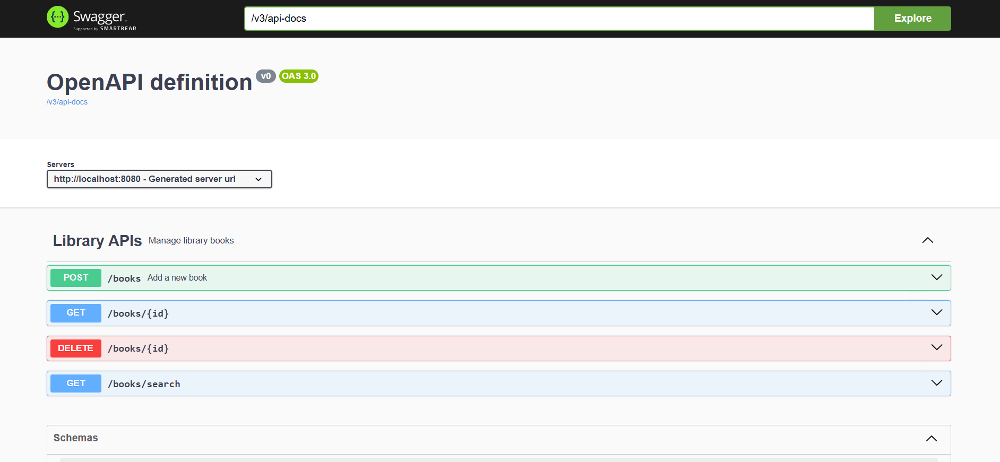
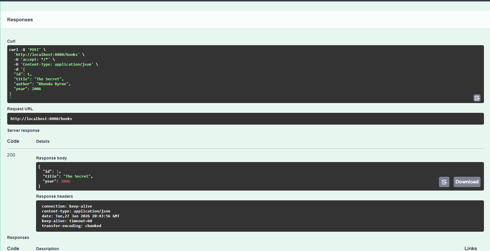
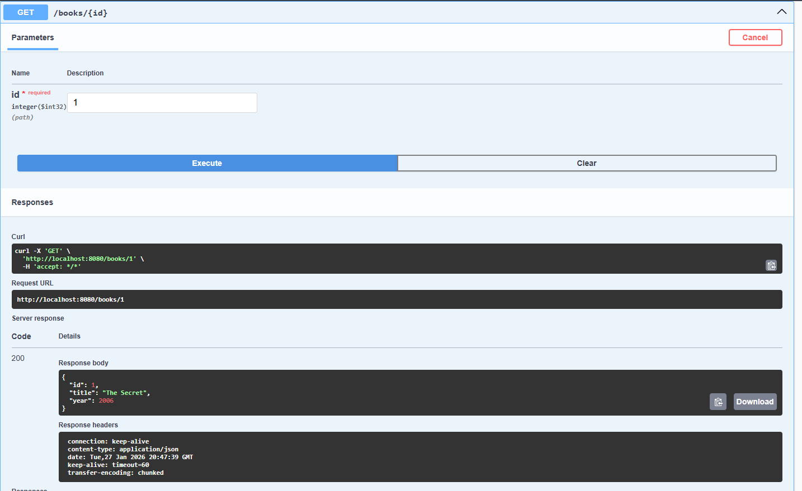
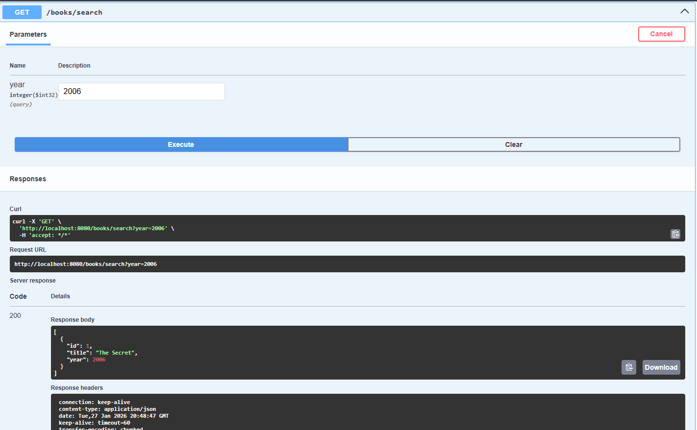
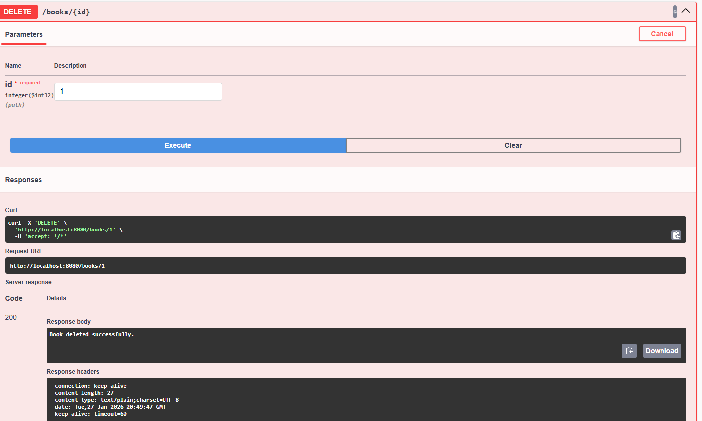

<h1>Library Book Inventory REST API</h1>

## 1. Project Title & Goal

A Spring Boot REST API that manages a library’s book inventory using strictly in-memory storage, allowing users to add, retrieve, search, and delete books.

---

## 2. Setup Instructions

Follow these exact steps to run the project locally:

```bash
# Clone the repository
git clone https://github.com/<your-username>/library-book-inventory-api.git

# Navigate to project directory
cd library-book-inventory-api

# Run the Spring Boot application
mvn spring-boot:run
```

Once the application starts successfully, access:

* Swagger UI: `http://localhost:8080/swagger-ui/index.html`

---

## 3. The Logic (How I Thought)

### Why did I choose this approach?

* I used **Spring Boot + REST** because it is industry-standard for backend services.
* In-memory storage using a **HashMap** was chosen to strictly follow the requirement of *no database usage*.
* Separating logic into **Controller, Service, and Model layers** keeps the code clean, scalable, and interview-ready.
* Swagger UI was added to make API testing and documentation easy without relying on external tools.

### Hardest bug faced & how I fixed it

* **Bug:** Postman requests were failing with `ECONNREFUSED` and later `400 Bad Request`.
* **Cause:**

  * Port mismatch between Swagger and Postman.
  * Missing required query parameter (`year`) in `/books/search` endpoint.
* **Fix:**

  * Ensured Postman used the same port as Swagger.
  * Passed required query parameters correctly (`?year=2024`).
  * Verified APIs using Swagger UI for cross-checking.

---

## 4. Output Screenshots
### Swagger UI


### Add Book – POST /books


### Get Book by ID – GET /books/{id}


### Search Book by Year – GET /books/search


### Delete Book – DELETE /books/{id}


---
## 5. Future Improvements

If I had **2 more days**, I would:

* Add **validation annotations** and proper HTTP status codes.
* Implement **global exception handling** for cleaner error responses.
* Secure APIs using **Spring Security**.

---

✅ This project is designed to be simple, clean, and extensible while demonstrating strong backend fundamentals.
